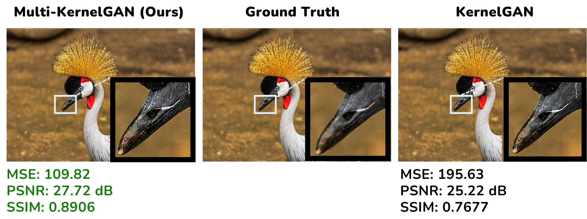

Here's a more professional version of the README, maintaining all stages and details:

---

# **Multi-KernelGAN**
## Multi-Kernel Estimation for Object Segmentation and Super-Resolution

### Authors: Asaf Yekutiel, Haim Goldfisher

This project is an extension of the [KernelGAN](https://github.com/sefibk/KernelGAN) framework, originally developed by Sefi Bell-Kligler, Assaf Shocher, and Michal Irani. Additionally, this work leverages the [Segment Anything Model (SAM)](https://github.com/facebookresearch/segment-anything) for image segmentation and [YOLOv8](https://github.com/ultralytics/ultralytics) for object detection, creating an enhanced super-resolution pipeline with multiple kernel estimations.

---

### Google Colab Notebooks

#### 1. **[Original KernelGAN + ZSSR](https://colab.research.google.com/github/kuty007/Multi-Kernel-GAN/blob/main/Colab%20Notebooks/KernelGAN.ipynb)**  

This notebook implements the original KernelGAN combined with Zero-Shot Super-Resolution (ZSSR). It estimates the kernel of a low-resolution input image and performs super-resolution based on the estimated kernel.

**Steps to run:**
1. Open the notebook using the Colab badge above.
2. Create two directories named `input` and `output` in the notebook environment.
3. Upload your low-resolution image into the `input` folder.
4. Run the steps in the notebook to estimate the image kernel and apply the ZSSR algorithm.
5. The super-resolved output will be saved in the `output` folder.

#### 2. **[Mask Generation with SAM](https://colab.research.google.com/github/kuty007/Multi-Kernel-GAN/blob/main/Colab%20Notebooks/Mask_Generator.ipynb)**  

This notebook uses Facebook’s Segment Anything Model (SAM) to generate object segmentation masks, which will later be used in the Multi-KernelGAN pipeline.

**Steps to run:**
1. Open the notebook via the Colab badge.
2. Ensure you have a directory in your Google Drive named `KernelGAN-Masks`, with two subfolders: `imgs` (for input images) and `masks` (for output masks).
3. Upload the images you wish to process into the `imgs` folder. For each image, there should be two versions: one low-resolution (LR) and one high-resolution (HR).
4. The notebook will generate segmentation masks for the objects in the images using SAM.
5. The output masks will be stored in the `masks` folder, ready for use in subsequent steps of the pipeline.

#### 3. **[Multi-KernelGAN + ZSSR (Enhanced Pipeline)](https://colab.research.google.com/github/kuty007/Multi-Kernel-GAN/blob/main/Colab%20Notebooks/Run_MultiKernelGAN%2BZSSR.ipynb)**  

This notebook combines Multi-KernelGAN with ZSSR. It segments the image into different regions using object detection and segmentation, estimates multiple kernels for those regions, and applies ZSSR to each region separately for improved super-resolution results.

Steps to run:

First, run the Mask Generation with SAM notebook to generate object segmentation masks.
Open the Multi-KernelGAN notebook by clicking the Colab badge above.
Add three more subfolders in the KernelGAN-Masks directory:
code for storing the code needed to execute Multi-KernelGAN (View Code Folder).
weights for saving model weights.
exps for storing the experiment results.
The notebook will execute the Multi-KernelGAN process on each segmented region of the image. The results, including super-resolved regions, will be saved in the exps folder.
The final output will be a composite image where each segmented region is super-resolved, stored in the exps folder.

---

